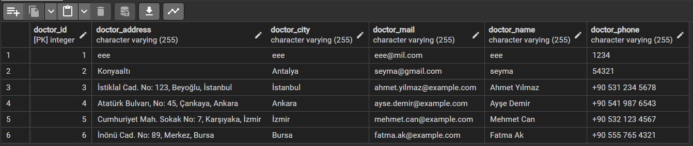

# Veterinary Management System Project

## PROJECT SUMMARY WITH A YOUTUBE VIDEO
Veterinary Management System is designed using N-layer architecture to streamline the daily operations of a veterinary clinic. It offers comprehensive functionalities to manage animals, appointments, doctors, customers, vaccine and available date.

### Click Below and Watch 
           

## Veterinary Management System UML Diagram

### PostgreSQL Database Images

- **Vaccine Table**

- **Doctor Table**

- **Customer Table**

- **Available Date Table**

- **Appointment Table**

- **Animal Database**

### Swagger Entity EndPoints

- **Vaccine Controller**

- **Doctor Controller**

- **Customer Controller**

- **Available Date Controller**

- **Appointment Controller**

- **Animal Controller**

## Technologies

- Java 21
- Spring Boot
- Spring Web
- Spring Data JPA
- PostgreSQL
- Lombok
- Mapstruct
- Postman
- Swagger

## Project Structure

The project includes the following components:

- **ENTITY**
- **REPOSITORY**
- **DTO** / REQUEST-RESPONSE
- **MAPPER**
- **SERVICE**
- **CONTROLLER**

## Running the Application

Since the project is developed with Spring Boot, you can follow the steps below to run the application:

1. Clone the source code of the project to your computer.
2. Create your PostgreSQL database and update the connection information in the `application.properties` file.
3. Open the project in an IDE (IntelliJ IDEA, Eclipse, etc.).
4. Find the `VeterinaryApp` class and run it.

Once the application is started, you can access the API at [http://localhost:8080](http://localhost:8081).

## Endpoints

Below is a list of basic endpoints provided by the API:

| Endpoint                        | HTTP Method | Description                                                      |
|---------------------------------|:------------|------------------------------------------------------------------|
| **vaccines**                    |             |                                                                  |
| `/api/v1/vaccines`              | GET         | Get the vaccine                                                  |
| `/api/v1/vaccines`              | PUT         | Update the vaccine                                               |
| `/api/v1/vaccines/{id}`         | DELETE      | Delete the vaccine with the specified ID                         |
| `/api/v1/vaccines`              | GET         | Get all vaccines                                                 |
| `/api/v1/vaccines`              | POST        | Add a new vaccine                                                |
| `/api/v1/vaccines/findByDate`   | GET         | Get vaccine records for the given date range                     |
| `/api/v1/vaccines/animal/{id}`  | GET         | Get all vaccine records for a specific animal                    |
|                                 |             |                                                                  |
| **doctors**                     |             |                                                                  |
| `/api/v1/doctors`               | GET         | Get the doctor                                                   |
| `/api/v1/doctors`               | PUT         | Update the doctor                                                |
| `/api/v1/doctors/{id}`          | DELETE      | Delete the doctor with the specified ID                          |
| `/api/v1/doctors`               | POST        | Add a new doctor                                                 |
|                                 |             |                                                                  |
| **customers**                   |             |                                                                  |
| `/api/v1/customers`             | GET         | Get the pet owner with the specified ID                          |
| `/api/v1/customers`             | PUT         | Update the pet owner with the specified ID                       |
| `/api/v1/customers/{id}`        | DELETE      | Delete the pet owner with the specified ID                       |
| `/api/v1/customers`             | POST        | Add a new pet owner                                              |
| `/api/v1/customers/byName`      | GET         | Get pet owners by name                                           |
|                                 |             |                                                                  |
| **available_dates**             |             |                                                                  |
| `/api/v1/available_dates`       | GET         | Get all available dates                                          |
| `/api/v1/available_dates/{id}`  | PUT         | Update the available date with the specified ID                  |
| `/api/v1/available_dates/{id}`  | DELETE      | Delete the available date with the specified ID                  |
| `/api/v1/available_dates`       | POST        | Add a new available date                                         |
|                                 |             |                                                                  |
| **appointments**                |             |                                                                  |
| `/api/v1/appointments`          | GET         | Get all appointments                                             |
| `/api/v1/appointments/{id}`     | PUT         | Update the appointment with the specified ID                     |
| `/api/v1/appointments/{id}`     | DELETE      | Delete the appointment with the specified ID                     |
| `/api/v1/appointments`          | POST        | Add a new appointment                                            |
| `/api/v1/appointments/doctorId` | GET         | Get appointments based on the user-entered date range and doctor |
| `/api/v1/appointments/animalId` | GET         | Get appointments based on the user-entered date range and animal |
|                                 |             |                                                                  |
| **animals**                     |             |                                                                  |
| `/api/v1/animals`               | GET         | Get all animals                                                  |
| `/api/v1/animals`               | PUT         | Update the animal with the specified ID                          |
| `/api/v1/animals/{id}`          | DELETE      | Delete the animal with the specified ID                          |
| `/api/v1/animals`               | POST        | Add a new animal                                                 |
| `/api/v1/animals/customer/{id}` | GET         | Get animals by pet owners id                                     |
| `/api/v1/animals/{name}`        | GET         | Get animals by pet owners name                                   |
|                                 |             |                                                                  |

